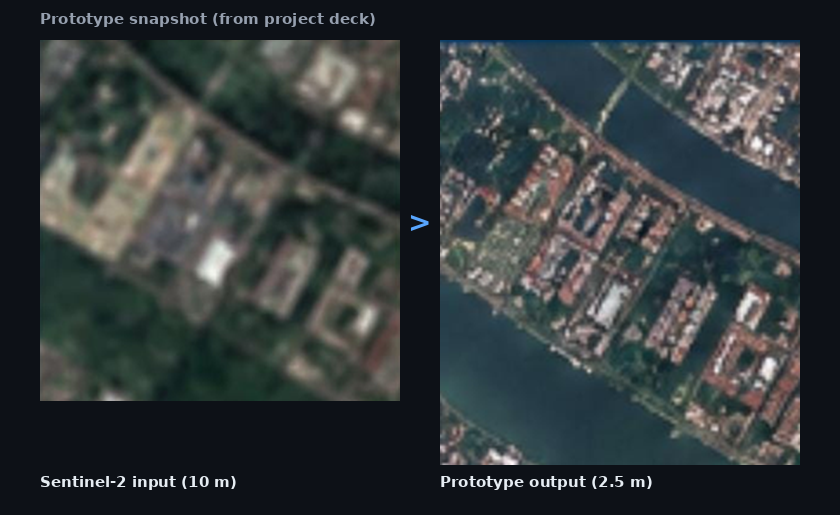
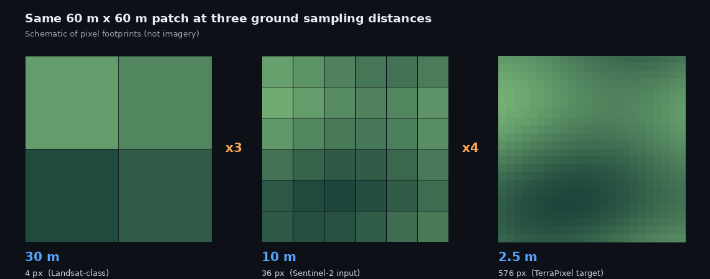

<div align="center">

# 🛰️ TerraPixel

### Trust-Aware Deep Learning for Satellite Super-Resolution Mapping

**Sentinel-2 10 m → 2.5 m, with physics-grounded training, spectral fidelity and calibrated per-pixel uncertainty**




<sub>Prototype snapshot taken from the project deck. The two tiles show different areas; a same-extent comparison with metrics will replace this (see <a href="#-results">Results</a>).</sub>

</div>

---

## 📌 Table of contents

- [The problem](#-the-problem)
- [Our approach](#-our-approach)
- [Pipeline](#-pipeline)
- [How we get a 2.5 m reference](#-how-we-get-a-25-m-reference)
- [Trust and uncertainty](#-trust-and-uncertainty)
- [Why not a GAN?](#-why-not-a-gan)
- [Targets and evaluation](#-targets-and-evaluation)
- [Results](#-results)
- [Tech stack](#-tech-stack)
- [Getting started](#-getting-started)
- [Roadmap](#-roadmap)
- [Limitations](#-limitations)
- [References](#-references)

---

## 🎯 The problem

Sentinel-2 gives free, frequent, wide-area imagery at **10 m**, but roads, small buildings, field boundaries and water edges are only a pixel or two wide at that scale. Super-resolution can help, but naive approaches create risks:

| Risk | What goes wrong |
|---|---|
| **Hallucinated detail** | Sharp outputs invent roads, roofs or textures the input never contained |
| **Spectral distortion** | Sharpening alters B/G/R/NIR values and corrupts NDVI/NDWI |
| **Misleading evaluation** | PSNR/SSIM alone do not prove geographic truth or analytical usefulness |
| **Physical and data limits** | The model must respect Sentinel-2 MTF/PSF, and real low/high-resolution pairs are scarce |

> Problem statement **SIH26142**: *Deep Learning Based Super Resolution Mapping (SRM) from Medium Resolution Satellite Imageries*, producing sub-4 m outputs while preserving geospatial and spectral consistency and accounting for uncertainty.

## 💡 Our approach

TerraPixel is a **constrained, non-adversarial** super-resolution pipeline. Instead of asking "does it look sharp?", it asks "can the output be explained by the input, and does it stay analytically usable?"

<div align="center">

</div>

| Pillar | How |
|---|---|
| 🔬 **Physics-grounded SR** | RCAN-style channel-attention backbone (~12-15M parameters) with a degradation-consistency loss tied to the published Sentinel-2 MTF/PSF |
| 🌈 **Spectral preservation** | Cross-band attention plus SAM, NDVI and NDWI constraints keep B2/B3/B4/B8 analytically intact |
| 🎚️ **Trust-aware output** | A 3-model ensemble gives a per-pixel uncertainty map, calibrated with split-conformal prediction |
| 🧪 **Real evidence** | Validation against SPOT and Sen2Venµs references plus downstream land-cover IoU and geometric checks |

## 🔄 Pipeline

```mermaid
flowchart LR
    A[Sentinel-2 L2A<br/>10 m, B2 B3 B4 B8] --> B[Preprocessing<br/>SCL / s2cloudless masking<br/>co-registration, normalisation]
    B --> C[Patch and tensor pipeline]
    C --> D[Attention backbone<br/>RCAN-style, 4x]
    D --> E[Constraint-aware losses<br/>L1 + edge + spectral + degradation]
    E --> F[2.5 m reconstruction]
    F --> G[3-model ensemble<br/>uncertainty map]
    G --> H[Conformal calibration]
    H --> I[Validation<br/>PSNR SSIM SAM NDVI/NDWI IoU]
    I --> J[Web export<br/>GeoTIFF + metrics]
```



**Tracks**

| Track | Role |
|---|---|
| **A. Data and preprocessing** | Surface reflectance → SCL/s2cloudless masking → cloud/shadow filter (patches with more than 20% cloud rejected) → co-registration → normalisation → overlapping patches |
| **B. Super-resolution** | RCAN/EDSR-style CNN, 4× upsampling, multispectral B2/B3/B4/B8, cross-band attention, bicubic baseline for PSNR/SSIM/SAM/NDVI-MAE |
| **C. Trust-constrained learning** | L1 (pixel) + gradient/edge (structure) + spectral (fidelity) + degradation (physical consistency, MTF/PSF-informed) |
| **D. Trust and validation** | 3-model ensemble uncertainty (MC-Dropout fallback), re-degradation consistency check, conformal coverage, flagging of unsupported detail |

## 🧭 How we get a 2.5 m reference

No public dataset provides a *native* 2.5 m multispectral reference for Sentinel-2. We build the best available proxies and say so.

**Training pairs**

1. Pansharpen SPOT 6/7 (1.5 m PAN + 6 m MS) and resample to 2.5 m, giving the HR target.
2. Degrade the target with the Sentinel-2 MTF/PSF model plus sensor noise to 10 m, giving a synthetic LR input.
3. Fine-tune and test on real S2↔SPOT pairs (WorldStrat) after co-registration, date-gap filtering, cloud masking and radiometric matching.

**Validation proxies**

| Check | Compare | What it proves |
|---|---|---|
| **Consistency** | SR degraded back to 10 m vs the original S2 input | Nothing contradicts the observed data |
| **Spectral** | SR downsampled to 6 m vs SPOT native MS | B/G/R/NIR fidelity, NDVI/NDWI accuracy |
| **Spatial** | SR structure vs SPOT PAN (1.5 m) | Edges, roads, building outlines |
| **Cross-sensor** | SR downsampled to 5 m vs Sen2Venµs | Independent secondary check |

| Dataset | Role |
|---|---|
| WorldStrat (SPOT 6/7) | Primary paired reference |
| Sen2Venµs (5 m) | Secondary cross-check |
| OLI2MSI (30 m → 10 m) | Backbone pretraining only (3× scale; the upsampling head is re-initialised for 4×) |

## 🎚️ Trust and uncertainty

Each pixel gets a prediction and an uncertainty estimate, then a calibrated interval.

1. The 3-model ensemble gives a per-pixel mean μ and spread σ.
2. On a held-out calibration set, compute scores |y − μ| / σ.
3. Take the ⌈(n+1)(1−α)⌉ / n quantile q̂ of those scores.
4. The prediction interval is **μ ± q̂·σ**, targeting **90% coverage (α = 0.10)**.

What this does and does not claim:

- ✅ Finite-sample **marginal** coverage under exchangeability, measured empirically on test scenes and reported overall and per land-cover class.
- ✅ Calibration scenes are separate from training and test scenes, because neighbouring pixels are correlated.
- ✅ Coverage is with respect to the SPOT-derived proxy reference.
- ❌ It is **not** a guarantee against out-of-distribution inputs. Those are flagged separately using an ensemble-disagreement threshold.

## 🚫 Why not a GAN?

The problem statement suggests generative models. GANs and diffusion models optimise perceptual realism, which is exactly what raises hallucination risk in scientific imagery. TerraPixel's final model is non-adversarial. We run an **adversarial-loss ablation for comparison only**, to show the trade-off (better perceptual scores vs worse SAM and NDVI error).

## 📊 Targets and evaluation

> These are **targets**, not achieved results. The measured column is filled in as experiments complete.

| Metric | Target | Evaluated on | Measured |
|---|---|---|---|
| PSNR | ≥ 30 dB | Held-out Sen2Venµs / WorldStrat tiles (synthetic-degraded and real cross-sensor reported separately) | _TBD_ |
| SSIM | ≥ 0.85 | Same | _TBD_ |
| NDVI MAE | < 0.05 | 2.5 m SR vs reference NDVI | _TBD_ |
| Spectral Angle Mapper | < 0.1 rad | Per pixel | _TBD_ |
| Conformal coverage | ≈ 90% (α = 0.10) | Test scenes, overall and per land-cover class | _TBD_ |
| Tie-point RMSE | ≤ 0.5 SR pixel (1.25 m) vs input | Georegistration check | _TBD_ |
| Inference time | < 60 s per 10 × 10 km tile (100 km²), single GPU | Benchmarked, single model and full ensemble reported separately | _TBD_ |
| Land-cover IoU | Improvement over bicubic baseline | Downstream task | _TBD_ |

## 🖼️ Results

_Preliminary results will appear here._ Planned panels:

- Same-extent **10 m input · bicubic 4× · TerraPixel 2.5 m · SPOT reference**
- Per-pixel **uncertainty map** next to absolute error
- **NDVI before/after** with error map
- Baseline comparison table (bicubic vs TerraPixel vs adversarial ablation)

<!-- Replace with real assets when available:

-->

## 🧰 Tech stack

| Layer | Tools |
|---|---|
| AI / ML | Python, PyTorch |
| Remote sensing | Rasterio, GeoTIFF workflows |
| Backend | FastAPI (GeoTIFF → tensor → SR → metrics → GeoTIFF) |
| Frontend | React / Next.js, Tailwind CSS (before/after slider, tile upload, live metrics, export) |
| Deployment | Docker |

## 🚀 Getting started

> Setup instructions will be added as the code lands. Planned interface:

```bash
# clone
git clone https://github.com/<your-org>/terrapixel.git
cd terrapixel

# backend
pip install -r requirements.txt
uvicorn app.main:app --reload

# frontend
cd web && npm install && npm run dev
```

Input: Sentinel-2 L2A GeoTIFF with bands B2, B3, B4, B8 at 10 m.
Output: 2.5 m GeoTIFF (same CRS and grid alignment), uncertainty raster and a metrics report.

## 🗺️ Roadmap

- [x] Problem analysis and solution design
- [x] Web prototype (10 m input → 2.5 m output view)
- [ ] Reference construction from WorldStrat / SPOT
- [ ] Backbone pretraining on OLI2MSI, 4× fine-tuning
- [ ] Ensemble training and conformal calibration
- [ ] Baseline and ablation benchmarks (bicubic, adversarial loss)
- [ ] Evaluation on Indian scenes
- [ ] Measured inference benchmark and Docker release
- [ ] Optional: multi-date fusion, evaluated against the single-scene baseline

## ⚠️ Limitations

- Single-image 4× super-resolution is fundamentally ill-posed. Some detail is inferred, which is why the uncertainty map ships with every output.
- No native 2.5 m multispectral reference exists, so validation relies on proxies (see above).
- Only B2/B3/B4/B8 are supported. SWIR-based indices (burn, flood, moisture) are out of scope for now.
- Performance on scenes very different from the training data (climate, land cover, cloud regime) needs dedicated evaluation.

## 📚 References

1. Lanaras et al., **DSen2**, super-resolving Sentinel-2 bands. https://arxiv.org/abs/1803.04271
2. **Multi-Spectral Multi-Image Super-Resolution with Radiometric Consistency Losses**. https://arxiv.org/abs/2111.03231
3. **Uncertainty Quantification with Deep Ensembles for Sentinel-2 Super-Resolution**. https://doi.org/10.3390/psf2023009004
4. **Radiometrically and Spatially Consistent Super-Resolution Framework for Sentinel-2**. https://www.sciencedirect.com/science/article/pii/S0034425725006261
5. **Holistic Approach for Multi-Spectral Sentinel-2 Super-Resolution and Spectral Evaluation**. https://www.tandfonline.com/doi/full/10.1080/01431161.2025.2549132

<sub>Please verify all links and citations before publishing.</sub>

---

<div align="center">

**Team TerraPixel** · Smart India Hackathon 2026 · Team ID 168905

</div>
